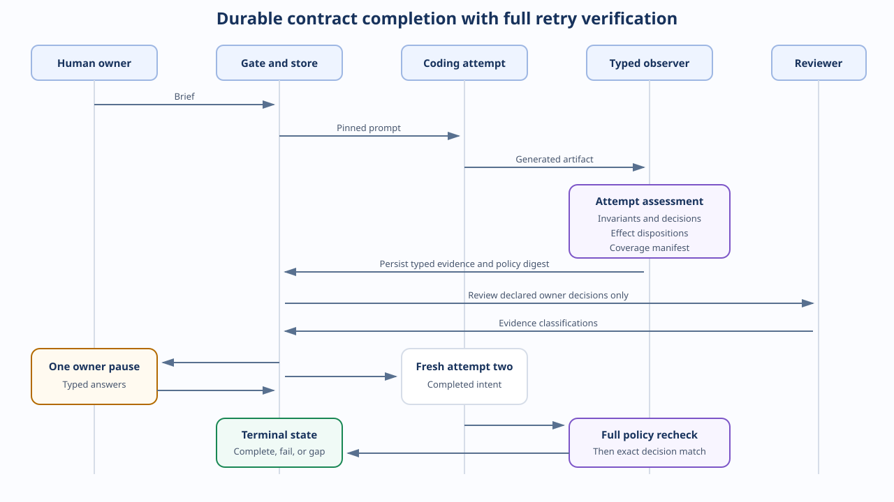
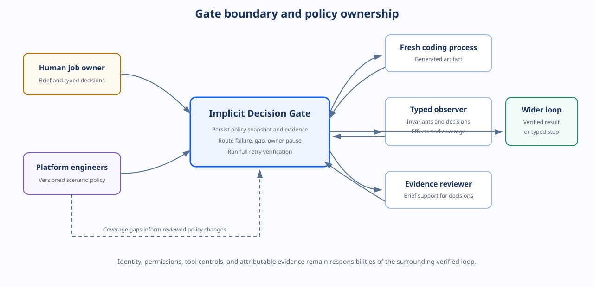

# Implicit Decision Gate

Implicit Decision Gate is a proof of concept for completing missing intent in
agent-generated work. It applies one part of the trust architecture described in
1Password's
[Verified Loops](https://1password.com/blog/verified-loops-building-ai-agent-trust):
observe what generated work actually does, pause only for genuine product decisions, and
verify a fresh result against the completed contract.

The gate now separates four concerns that a production implementation can't safely
collapse:

| Surface | Meaning | Terminal behavior |
| --- | --- | --- |
| Invariants | Requirements already fixed by the brief or platform | A violation is `FAILED` |
| Decisions | Declared alternatives the owner may legitimately choose | Unsupported intent can pause in `AWAITING_OWNER` |
| Effect policy | Expected, allowed, forbidden, or unclassified changes | Forbidden is `FAILED`; unclassified is `COVERAGE_GAP` |
| Coverage manifest | Proof that every required observer rule ran | Missing evidence is `COVERAGE_GAP` |

Unknown evidence is persisted as an `UnknownEffect`. It is never disguised as an option,
a pass, or a generic exception.

## What it demonstrates

- One observer can report multiple independent decision axes from one artifact.
- Requirements aren't presented to a human as negotiable choices.
- Every structural effect receives exactly one versioned policy disposition.
- Required observer coverage is declared before execution, with missing results made
    explicit.
- A durable run pins the policy snapshot and digest used to interpret its evidence.
- Attempt two repeats the full invariant, effect, and coverage pipeline before exact
    decision verification.
- The notebook and web replay consume the same typed contract as persisted runs.

## Primary example

The workspace-export brief fixes two requirements and leaves two decisions open:

| Brief specifies | Brief doesn't specify |
| --- | --- |
| The first owner request creates an export | Whether administrators can create exports |
| Members are denied | What a repeated owner request should do |

A disposable, network-disabled container calls the generated handler twice as an owner
with shared state, then once each as an administrator and member. It reports:

- `owner_first_request` and `member_denied` as authoritative invariants.
- Administrator access as `OWNER_ONLY` or `OWNER_AND_ADMIN`.
- Repeated-request behavior as `CREATE_ANOTHER_EXPORT` or `REUSE_ACTIVE_EXPORT`.
- Four coverage attestations proving all declared calls ran.

If the brief doesn't support the two observed decision options, the gate presents both
questions in one `AWAITING_OWNER` pause. It then starts one fresh coding attempt and
requires both decisions and every other policy surface to pass again.

The workspace-export and share-link scenarios are fictional. They make no claim about
1Password's production services, schema, or authorization model.

## How the gate works



[Review the Mermaid source.](notebooks/assets/diagrams/lifecycle.mmd)

1. Pin the authoritative brief, technical context, and versioned scenario policy.
2. Ask a fresh coding process to generate one scenario artifact.
3. Execute every declared observer rule and normalize typed evidence.
4. Fail any violated invariant or forbidden effect.
5. Record any unknown effect, unclassified effect, or missing coverage as a structured
    `COVERAGE_GAP`.
6. Review only recognized owner-selectable decisions against the original brief.
7. If intent is missing, persist one pause and collect all required owner answers.
8. Start a clean coding attempt with the original inputs and completed intent.
9. Repeat steps 3 through 5, then compare the final decisions exactly.

The evaluation order is deliberate. A correct owner choice can't hide a broken
requirement, an unauthorized side effect, or an observer that didn't run.

## Run the primary demo

Requirements:

- Python 3.12
- [uv](https://docs.astral.sh/uv/)
- An installed and authenticated [Codex CLI](https://learn.chatgpt.com/docs/non-interactive-mode)
- Docker
- [`jq`](https://jqlang.github.io/jq/) only for optional inspection

From the repository root:

```bash
uv sync --extra dev
codex --version
uv run idg start --scenario workspace-export-authorization
```

`start` returns the policy digest, invariant results, observed options, effect
dispositions, coverage manifest, and any owner decision requests. For example:

```bash
uv run idg answer RUN_ID \
    --decision workspace_export_administrator_access \
    --option OWNER_ONLY

uv run idg answer RUN_ID \
    --decision workspace_export_repeat_request \
    --option REUSE_ACTIVE_EXPORT

uv run idg resume RUN_ID
```

Each `answer` records one typed decision without invoking a model. A successful resume
ends in `COMPLETED` only after a clean second attempt passes the full policy and matches
the completed decision set.

## Run the web interface

The static site loads a checked-in `DemoDataset` validated by the same Python models used
to project real `RunRecord` snapshots. It includes owner pauses, invariant failures,
forbidden and unclassified effects, missing observer results, retry mismatches, and an
attempt-two side effect.

```bash
uv run python -m http.server 8000 --directory web/public
```

Open [http://localhost:8000](http://localhost:8000). Deep links preserve the selected
view, scenario, replay case, and attempt in the URL fragment.

To export real run snapshots through the same presentation contract:

```bash
uv run python scripts/export_demo_runs.py \
    .idg/runs/RUN_ID/run.json
```

## Supported observers

### Workspace export behavior

The API observer measures returned status codes and changes to the supplied export-job
list. It declares four required probes: first owner, member, administrator, and repeated
owner. Unsupported administrator or repeat behavior becomes an `UnknownEffect`. A wrong
first-owner or member result violates an invariant and fails directly.

### PostgreSQL share-link behavior

The database observer seeds an existing row, applies the generated migration, inserts a
new row, records normalized facts and structural effects, and rolls the transaction back.

| Category | Declared behavior |
| --- | --- |
| Invariants | Correct expiration column, new links expire after about 30 days, rollback succeeds |
| Decision | Existing links remain non-expiring or receive an expiration |
| Structural effects | Requested expiration column is expected; removals are forbidden; other changes require policy |
| Coverage | Column, new row, existing row, schema, integrity, indexing, and rollback rules all attest |

The catalog surface reports sorted `ADDED`, `REMOVED`, and `CHANGED` effects for:

| Rule | Observed structure |
| --- | --- |
| `schema_shape` | Tables and column type, nullability, and default |
| `data_integrity` | Primary-key, unique, check, and foreign-key constraints |
| `indexing` | Standalone index definition and uniqueness |

This remains a bounded view of PostgreSQL structure. Transient operations, row rewrites,
locks, data loss, query plans, and performance need separate behavioral observers.

## Expanding to a large codebase

The shared state machine is general. Coverage is not. A production rollout would add
platform-owned adapters for the high-consequence surfaces in that organization:

| Surface family | Representative evidence |
| --- | --- |
| API and compatibility | OpenAPI or protobuf diffs, error semantics, idempotency, consumer contracts |
| Authorization and identity | Role-capability matrices, resource isolation, escalation paths, audit events |
| Data and schemas | DDL, backfills, retention, destructive changes, rollback, online migration safety |
| Events and workflows | Schema compatibility, ordering, retries, deduplication, dead-letter behavior |
| Dependencies and supply chain | Manifest and lockfile diffs, licenses, provenance, vulnerability policy |
| Infrastructure and operations | IAM, networking, storage, secrets, deployment topology, rollback readiness |
| Runtime quality | Tests, static analysis, performance budgets, telemetry, error and cost budgets |
| User-facing behavior | Accessibility, localization, browser flows, analytics, privacy and consent |

Robustness comes from governance around those adapters:

- A scenario declares required rule IDs, observer versions, owners, and descriptions.
- The run pins that policy snapshot and refuses later commands if current policy differs.
- Observers return evidence digests, so a claimed pass requires attributable evidence.
- Every effect must receive exactly one disposition; conflicting classifiers are a policy
    error.
- Missing, duplicate, and undeclared observer results fail closed or become explicit gaps.
- Negative fixtures cover violations, forbidden changes, unknown effects, missing rules,
    verification mismatches, and attempt-two regressions.
- Policy expansion happens through normal reviewed engineering changes, never inside the
    product run being judged.

For a large monorepo, the next architectural step is an impact planner that maps changed
files and dependency edges to required scenario policies. That planner should be
conservative: uncertain impact expands the manifest rather than silently dropping checks.
The gate can then fan observers out, aggregate their typed results, and preserve the same
terminal semantics demonstrated here.

## Trust boundary



[Review the Mermaid source.](notebooks/assets/diagrams/system_context.mmd)

The first and second coding attempts use separate processes and clean detached worktrees
at the same original commit. Attempt two receives the original brief, technical context,
and selected owner decisions. It doesn't receive attempt one's artifact, model response,
or reviewer rationale.

`run.json` persists the prompts, model provenance, immutable policy snapshot and digest,
decision records, invariant evidence, effect dispositions, coverage manifest, immutable
artifact digests, typed terminal reason, and current state. Raw model transcripts aren't
retained.

The repository doesn't implement authenticated human and agent identity, controlled tool
access, production permission enforcement, attributable external evidence, an append-only
event ledger, or policy distribution. Those remain responsibilities of the wider verified
loop.

## Guided notebook

The [guided notebook](notebooks/implicit-decision-gate-walkthrough.ipynb) presents one live
workspace-export lifecycle, all supported API and database decisions, PostgreSQL
structural coverage, and deterministic adversarial routes. Its helper module uses typed
`RunRecord` and `ObservationResult` models instead of interpreting raw outcome dictionaries.

```bash
docker compose up -d --wait
uv run --with 'jupyterlab>=4.1,<5' jupyter lab \
    notebooks/implicit-decision-gate-walkthrough.ipynb
```

JupyterLab remains demo tooling rather than a project dependency.

## Inspect and validate

```bash
uv run idg show RUN_ID
jq '{state, policy_digest, decisions, coverage_gaps, failure}' \
    .idg/runs/RUN_ID/run.json
jq '.attempts[] | {observation, effect_dispositions, coverage_manifest}' \
    .idg/runs/RUN_ID/run.json
```

The deterministic suite doesn't invoke Codex. Start PostgreSQL to include the database
integration tests:

```bash
docker compose up -d --wait
uv run pytest
docker compose stop
```

Opt into the live Codex integration tests with:

```bash
IDG_LIVE_CODEX=1 uv run pytest tests/test_live.py -v
```
