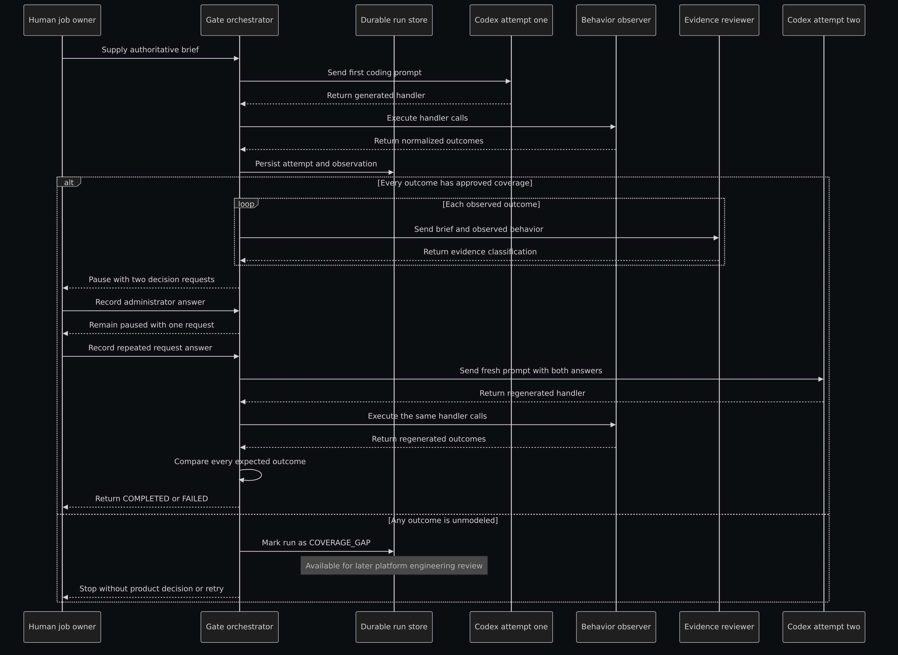
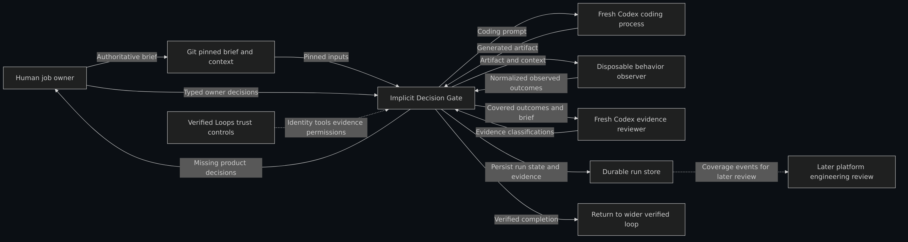

# Implicit Decision Gate

Implicit Decision Gate is a small proof of concept for completing missing intent in
agent-generated work. It applies one part of the trust architecture described in
1Password's
[Verified Loops](https://1password.com/blog/verified-loops-building-ai-agent-trust):
when runtime evidence reveals an important choice that the original request didn't make,
the system pauses for a human answer and verifies a fresh result against that answer.

The important signal comes from observed system effects, not the coding agent's
description of its own work.

## What it demonstrates

- One observer can report multiple independent decisions from one generated artifact.
- A separate evidence review can compare each observed behavior with the original brief.
- The gate can collect all required human answers in one durable pause.
- One fresh coding attempt can be verified against the complete decision set.
- An unmodeled observation can be recorded for later platform review without becoming a
    product decision or execution error.
- Different observers can reuse the same save, review, answer, retry, and verification
    lifecycle.

## Primary example

The workspace-export brief defines two requirements and leaves two decisions open:

| Brief specifies | Brief doesn't specify |
| --- | --- |
| The first owner request creates an export | Whether administrators can create exports |
| Members are denied | What a repeated owner request should do |

A generated Python handler must still choose both unspecified behaviors. A disposable,
network-disabled container calls the handler twice as an owner with shared state, then
once each as an administrator and member. It reports two independent outcomes:

| Decision | Supported options |
| --- | --- |
| Administrator access | `OWNER_ONLY` or `OWNER_AND_ADMIN` |
| Repeated owner request | `CREATE_ANOTHER_EXPORT` or `REUSE_ACTIVE_EXPORT` |

If the brief doesn't support the observed choices, the gate presents both questions in
one `AWAITING_OWNER` pause. The owner records one answer for each question. The gate then
starts one fresh coding attempt and verifies both regenerated outcomes.

This and the share-link example are fictional. They make no claim about 1Password's
production services, database schema, or authorization model.

## How the gate works



[Review the Mermaid source.](notebooks/assets/diagrams/lifecycle.mmd)

1. Pin the authoritative brief and technical context to one Git commit.
2. Ask a fresh coding process to generate one scenario artifact.
3. Execute the artifact with a bounded observer and normalize its effects.
4. If an effect is outside approved coverage, persist a structured `COVERAGE_GAP` event
    for later platform review and stop the product workflow.
5. Otherwise, review each typed outcome independently against the original brief.
6. If any choices are unsupported, persist one pause and collect the required owner
    answers.
7. Start one clean coding attempt with the original inputs and all selected answers.
8. Run the same observer and compare every expected outcome with the regenerated result.

Contradictory evidence, an execution error, or a second-attempt mismatch ends the run in
`FAILED`. An unmodeled first-attempt effect ends in `COVERAGE_GAP` without invoking the
evidence reviewer, product owner, or second coding attempt.

## Run the primary demo

Requirements:

- Python 3.12
- [uv](https://docs.astral.sh/uv/)
- An installed and authenticated [Codex CLI](https://learn.chatgpt.com/docs/non-interactive-mode)
- Docker
- [`jq`](https://jqlang.github.io/jq/) only for optional manual inspection

From the repository root:

```bash
uv sync --extra dev
codex --version
uv run idg start --scenario workspace-export-authorization
```

`start` returns a `run_id`, the two observed options, their evidence classifications,
and the required `decision_requests`. Choose one option for each request. For example:

```bash
uv run idg answer RUN_ID \
    --decision workspace_export_administrator_access \
    --option OWNER_ONLY

uv run idg answer RUN_ID \
    --decision workspace_export_repeat_request \
    --option REUSE_ACTIVE_EXPORT
```

Each `answer` command records exactly one typed decision and doesn't invoke a model. The
run remains in `AWAITING_OWNER` until every required answer exists. The final answer moves
the run to `READY_TO_RESUME`.

Start and verify one fresh attempt:

```bash
uv run idg resume RUN_ID
```

A successful run ends in `COMPLETED` only when both observed outcomes match the completed
decision set.

The project pins each coding and evidence-review invocation to
[`gpt-5.6-terra`](https://developers.openai.com/api/docs/models/gpt-5.6-terra) with
`xhigh` reasoning and records the invocation role, attempt number, decision identifier,
model, reasoning effort, and Codex CLI version.

## Supported observers

### Workspace export behavior

The workspace-export observer runs one generated Python module in a disposable,
network-disabled, read-only container. It measures returned status codes and changes to
the supplied export-job list.

The first owner request must return 202 and create one job. A member request must return
403 and create no job. The independent open decisions are:

- Whether an administrator receives 403 with no job or 202 with one job.
- Whether the second owner request creates another job or succeeds without creating an
    additional job.

Any unsupported combination is `UNMODELED`. The gate records its normalized facts and
artifact digest as a coverage event, returns `COVERAGE_GAP`, and stops before evidence
review.

### PostgreSQL share-link behavior

The default scenario asks Codex to add 30-day expiration to newly created item-sharing
links. The brief doesn't say what should happen to existing links. A PostgreSQL probe
distinguishes two supported outcomes:

| Option | Existing links | New links |
| --- | --- | --- |
| `PRESERVE_EXISTING` | Remain non-expiring | Expire after 30 days |
| `EXPIRE_EXISTING` | Receive an expiration | Expire after 30 days |

Run it with the disposable PostgreSQL 17 service:

```bash
docker compose up -d --wait
uv run idg start
```

The behavioral probe seeds an existing row, applies the generated migration, inserts a
new row, records normalized facts, and rolls the transaction back. This establishes the
effect of the migration without inferring behavior from SQL text.

### PostgreSQL structural surface

The PostgreSQL observer also compares catalog snapshots before and after each migration.
Three reusable rules report sorted `ADDED`, `REMOVED`, and `CHANGED` structural effects:

| Rule | Observed structure | Covered operations |
| --- | --- | --- |
| `schema_shape` | Tables and column type, nullability, and default | Create or drop tables and columns; change observed column properties |
| `data_integrity` | Primary-key, unique, check, and foreign-key constraints | Add, remove, or replace observed constraints |
| `indexing` | Standalone index definition and uniqueness | Add, remove, or replace indexes with transactional DDL |

Each effect records the rule, change, object kind, schema-qualified identity, attribute,
and before and after values. This is a bounded view of final PostgreSQL structure in
`public`. It doesn't report transient operations, row rewrites, locks, data loss, or
performance. Those require targeted behavioral probes.

## Trust boundary



[Review the Mermaid source.](notebooks/assets/diagrams/system_context.mmd)

| Component | Responsibility |
| --- | --- |
| Human brief | Defines authoritative intent |
| Coding model | Proposes one artifact from the supplied inputs |
| Observer | Reports bounded system effects |
| Evidence reviewer | Checks whether the brief explicitly supports each effect |
| Human owner | Supplies missing product decisions |
| Gate | Persists state, controls transitions, and verifies regenerated outcomes |

An unmodeled result isn't sent to the human owner. The run records the decision
identifier, normalized facts and effects, attempt number, artifact digest, and pinned
commit. A separate platform workflow can later aggregate these events and decide whether
the observer's approved coverage should change through normal engineering review.

The first and second coding attempts use separate processes and clean detached worktrees
at the same original commit. Attempt two receives the original brief, technical context,
and selected owner decisions. It doesn't receive attempt one's artifact, model response,
or reviewer rationale.

`run.json` persists the material prompts, model provenance, independent decision records,
attempt observations, immutable artifact digests, and current run state. Raw model
transcripts aren't retained.

This repository doesn't implement the wider Verified Loops controls. A real integration
would still rely on the surrounding system for authenticated human and agent identity,
controlled tool access, attributable evidence, and permission enforcement.

## Guided notebook

The [guided notebook](notebooks/implicit-decision-gate-walkthrough.ipynb) presents one live
workspace-export lifecycle, all four supported API behavior combinations, a deterministic
API coverage gap, both supported PostgreSQL data behaviors, and the PostgreSQL structural
rule matrix. If the live first attempt produces an unmodeled result, the notebook displays
the persisted coverage event and skips that run's product-decision and retry cells without
raising an execution error. It retains the system-context, lifecycle, and gate-logic
diagrams while moving execution and display mechanics into one notebook helper module.

Launch it from the repository root:

```bash
docker compose up -d --wait
uv run --with 'jupyterlab>=4.1,<5' jupyter lab \
    notebooks/implicit-decision-gate-walkthrough.ipynb
```

JupyterLab remains demo tooling rather than a project dependency. The notebook invokes
the live Codex CLI, Docker observer, and disposable PostgreSQL probes and creates new
durable runs.

## Inspect and validate

Show the compact state of a durable run:

```bash
uv run idg show RUN_ID
```

Inspect the persisted decisions and observed outcomes:

```bash
jq '{state, decisions}' .idg/runs/RUN_ID/run.json
jq '.attempts[].observation.outcomes' .idg/runs/RUN_ID/run.json
```

The deterministic suite doesn't invoke Codex. Start PostgreSQL to include the database
integration tests:

```bash
docker compose up -d --wait
uv run pytest
docker compose stop
```

Opt into the live Codex integration tests with:

```bash
IDG_LIVE_CODEX=1 uv run pytest tests/test_live.py -v
```

## Boundaries

- The scenarios and outcome vocabularies are fixed by the application.
- Each covered surface needs its own bounded observer.
- The evidence reviewer doesn't provide arbitrary semantic understanding.
- The prototype doesn't authenticate or attribute the local human caller.
- The gate doesn't grant capabilities or enforce production permissions.
- The run record is an atomically replaced snapshot, not an append-only event ledger.
